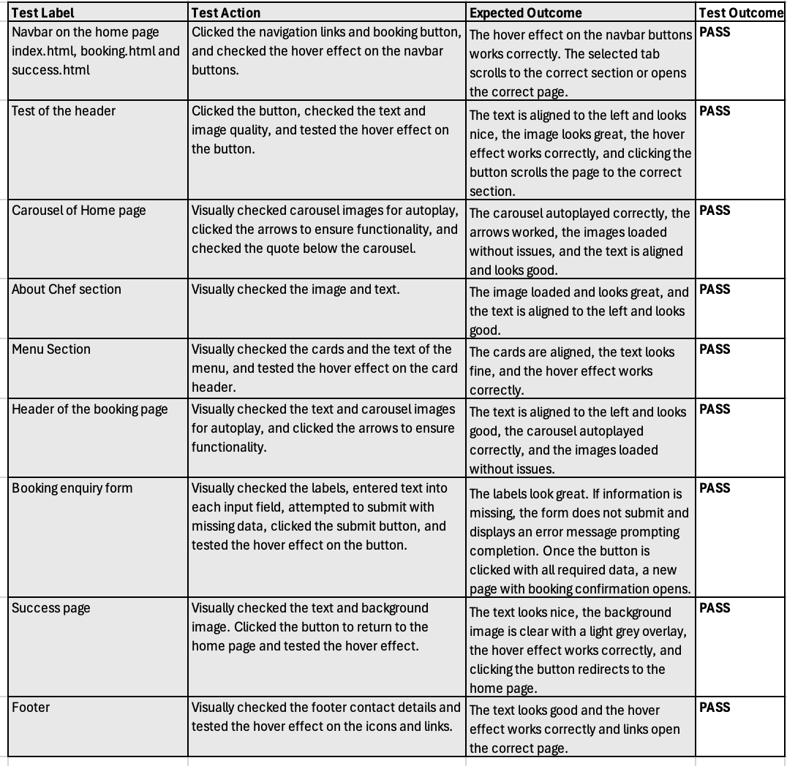

# Isadora Nascimento

## Private Chef

The Chef Spirov website is a concept project created to demonstrate the design, structure, and functionality of a professional service website. The website is user-friendly designed to connect Chef Spirov with private clients, events and corporate business. 

The purpose is to present how a private chef could showcase skills, menu, and booking options through a clean, responsive, and visually appealing online presence. While the site content is inspired by real-world service scenario, is not connected to an actual business and is intended for portfolio and esucational purpose only.

This project focuses on:

- Presenting a strong value proposition.
- Organizing clear navigation for various client types.
- Demonstrating responsive design and custom styling.
- Guiding the user smoothly from interest to a booking inquiry.

## Business Goals

- Showcase chef skills, sample menus, and event experience.
- Attract multiple client types: private clients, event hosts and corporate clients.
- Get clients to book private chef services.
- Build credibility though photos, professional presentation and testimonials.

## User Goals

- Easily find a chef for a specific event or need.
- View pricing, availability, and menus.
- Get a quick response or book online.
- Feel confident that the chef is reliable, high-quality, and professional.

## Strategy

The goal of the private chef website is to create a professional, visually engaging, and user-friendly online platform that builds trust and drives bookings. The strategy focuses on presenting the chef’s brand, skills, and experience in a way that resonates with various client types, from private individuals to corporate clients, while making the booking process seamless and intuitive.

## Scope

### Must Have 

- Homepage with a compelling value proposition and "Book Now" CTA
- Menu page with interactive sample menus and pricing packages
- Booking/inquiry form with calendar and service selection
- About page with chef bio, experience, and credentials
- Contact page with phone, email, and possibly WhatsApp integration

## Nice to Have 

- Client testimonials section
- Availability calendar or booking automation

## Structure

The user will visit the site because they are looking for a private chef for an event or personal service. The structure should guide them through:

1.	Value proposition – Clear statement of what the service offers (on homepage).
2.	Service offerings – Detailed menus with pricing.
3.	Chef credibility – Chef experience, bio and photos.
4.	Booking process – Simple and accessible booking enquiry and form submission.
5.	Contact and support – Social media, Email address and contact number.

Information Architecture:

- Homepage: Overview, booking CTA, intro to chef.
- About: Chef bio and service philosophy.
- Menu: Sample menus, dishes with pricing.
- Booking: Booking enquiry, form submission and contact info.
- Contact: Phone, Email and social meddia.

## Skeleton

Priority Content:

- High Priority (Top-level navigation + hero section):

1. Booking CTA
2. Menus
4. Contact options

- Medium Priority (secondary sections or deeper pages):

1. Chef’s bio

- Lower Priority (footer):

1. Blog, social links, privacy policy

Navigation:

1. Sticky top navigation bar with: Home | About | Menus | Book Now | Contact
2. Scrollable homepage with anchor links to each section.
3. Prominent “Book Now” buttons throughout.

## Surface

-	Color Palette: Neutral base (light ivory) + rich accent (sky blue).
-	Typography: Elegant serif for headings (Lora), clean sans-serif for body (Inter Tight).
-	Imagery: High-resolution food and chef photos.

-	Design Elements: 

1. Smooth animations (hover effects, fading transitions).
2. Subtle textures or overlays for elegance.
3. Icons for service features.


## User Stories

1.	Private Client (Host)

Description: Individuals or families hosting a private dinner or party at home or a rented space.

Needs: 

- Hire a private chef for a dinner, celebration, or event
- View available sample menus or customize one
- Understand pricing and booking process

User Stories:

- As a private client, I want to view sample menus so I can choose a menu that fits my event.
- As a private client, I want to check pricing and sample menus so I can book a chef confidently
- As a private client, I want to customize a menu, so the food matches my preferences and dietary needs


2.	Corporate Client 

Description: A business, gallery, or brand organizing an event (e.g., exhibition, product launch) and needs catering.

Needs:

- Find a professional chef to cater a formal/informal event
- Ensure branding alignment and presentation
- Request a quote or proposal

User Stories:

- As a gallery owner, I want to see the menus, so I know the chef can deliver high-end service
- As a corporate client, I want to get a quote for my event so I can plan the budget accordingly
- As a business, I want catering that aligns with my brand image to impress my guests

## Features

Responsive Navigation Bar – Fixed at the top of the page and fully responsive. Clicking a menu item smoothly scrolls to the corresponding section, while "Book Now" opens a dedicated booking page with an enquiry form. After submission, users are redirected to a success page confirming their booking request.

- Home Page: Image of Chef Spirov preparing a dish, paired with a short, engaging service message and a prominent CTA button inviting visitors to explore the menu. Image carousel showcasing the chef’s signature dishes.
- About Chef: High-quality portrait of the chef cooking, with an accompanying biography describing his expertise, training, and unique style.
- Menu: Interactive headers with hover effects for each menu category. Each section includes a dish image followed by a breakdown of the starter, main course, and dessert. A footer section displaying pricing details.
- Contact Section: Located in the footer with the chef’s contact details and social media links, making it easy for clients to connect.
- Booking (Book Now): Dedicated booking enquiry page featuring a form with fields for visitor details, and a message field where clients can specify order preferences or ask questions. A submit button sends the enquiry and redirects users to a success page confirming that their request has been received.

## Tecnologies Used

- HTML & CSS: Core programming languages used to structure and style the website.
- Bootstrap 5: Framework used to streamline layout development and ensure full responsiveness across devices.
- Font Awesome: Provides icons for improved visual design and user interaction.
- Google Fonts: Used to enhance typography with elegant and professional font choices.
- jQuery: Supports JavaScript functionality to ensure smooth interactions, including the automatic collapsing of the Bootstrap mobile navbar when navigating to in-page links.
- Images: All external images were generated using AI, except for the chef’s portrait, which is a real photograph.
- GitHub: The project’s source code is hosted on GitHub for version control and collaboration.

## Manual Testing

### Navbar
- Clicked each navigation link and the booking button.
- Verified each link scrolls to the correct section or opens the correct page.
- Checked hover effect on all navbar buttons – works correctly.

### Header Section
- Verified header text is left-aligned and visually appealing.
- Confirmed header image loads correctly.
- Clicked “Explore Menu” button – hover effect works and page scrolls to correct section.

### Carousel (Home Page)
- Verified images load correctly.
- Checked autoplay works smoothly.
- Clicked navigation arrows – functionality is correct.
- Verified quote below carousel is displayed and aligned properly.

### About Chef Section
- Confirmed image loads successfully.
- Verified text alignment is correct.

### Menu Section
- Verified all cards are aligned properly.
- Checked menu text displays correctly.
- Tested hover effect on card headers – works as expected.

### Header of Booking Page
- Verified text is left-aligned and displays correctly.
- Checked carousel images load correctly.
- Confirmed autoplay and arrow navigation work without issues.

### Booking Enquiry Form
- Checked all labels display correctly.
- Entered text into each input field.
- Attempted to submit with missing fields – correct error messages displayed.
- Submitted form with all fields completed – booking confirmation page opens successfully.
- Verified hover effect on submit button – works correctly.

### Success Page
- Verified text is displayed clearly.
- Confirmed background image displays with light grey overlay.
- Tested hover effect on “Return to Home” button – works correctly.
- Clicked button – redirected to home page successfully.

### Footer
- Checked all contact details, icons display and open the correctly.
- Verified hover effects on icons – work correctly.

### Responsive Design
- Checked responsive grid layout on desktop screen – displays correctly.
- Checked responsive grid layout on tablet screen – displays correctly.
- Checked responsive grid layout on mobile screen – displays correctly.

## User Stories testing

### Private Client (Host)

- **View sample menus to choose a menu that fits the event**  
  *Test Action:* Navigate to the Menu page or menu section and review the sample menus displayed.  
  *Expected Outcome:* Sample menus are clearly presented, easy to read, and visually appealing.

- **Check pricing and availability to book confidently**  
  *Test Action:* Check the booking page for submit any enquiry.  
  *Expected Outcome:* Pricing details are visible; booking form allows form submission with enquiry.

- **Customize a menu to match preferences and dietary needs**  
  *Test Action:* Use any menu customization options or contact form to request custom menus.  
  *Expected Outcome:* User can easily specify preferences or dietary needs through the form.


### Corporate Client

- **See menus to confirm high-end service**  
  *Test Action:* Visit the Menu section and review the range of menus offered.  
  *Expected Outcome:* Menus are presented professionally and reflect high-end service quality.

- **Request a quote for the event to plan budget**  
  *Test Action:* Locate and use the booking or contact form to request a quote.  
  *Expected Outcome:* Form clearly allows requesting quotes and submitting event details.

- **Ensure catering aligns with brand image to impress guests**  
  *Test Action:* Review the About and Services sections for branding and presentation information.  
  *Expected Outcome:* Website content conveys professionalism and ability to tailor catering for brand alignment.

### Automated testing with Lighthouse

### HTML and CSS validation

The code has been validate using the W3C tools:

- [W3C Markup Validation - HTML](https://validator.w3.org/) 

- [W3C CSS Validation](https://jigsaw.w3.org/css-validator/)

## Functionality 

 

## Deployment

This project is hosted on GitHub Pages, a free service that publishes websites directly from a GitHub repository.

**Steps to deploy:**

1. Open the repository for this project on GitHub.
2. Click the Settings tab at the top of the page.
3. From the left-hand menu, under Code and automation, select Pages.
    In the Build and deployment section:
    Source → Deploy from a branch
    Branch → main
    Folder → / (root)
4. Click Save.
5. Return to the Code tab and wait a few minutes while GitHub builds and publishes the site.
6. Once the process is complete, go to the Environments section on the right-hand side of the repository page.
7. Click github-pages, then select View deployment to open the live site.

### Getting the Code onto Your Computer (Cloning and Forking)

To make updates or changes to the website, you need a copy of the code on your computer. There are two main ways to do this: **Cloning** and **Forking**.

#### Cloning

- Cloning means you make a direct copy of the project’s repository to your computer.  
- When you clone, your copy is linked to the original repository.  
- Any changes you make and push will be sent to the original repository for approval.  
- This method is best if you are directly involved with the project and want to contribute changes that will be merged into the original code.

**How to clone the repository:**

1. On the GitHub project page, click the green **Code** button.  
2. Copy the URL (`https://github.com/isadoraspirov/private-chef`).  
3. Open your computer’s terminal or command prompt.  
4. Type:  
   ```bash
   git clone https://github.com/isadoraspirov/private-chef 
5. Press Enter. This downloads the project files to your computer.

#### Forking

- Forking means you create your own copy of the repository under your GitHub account.
- Your fork is independent, so you can make changes without affecting the original project.
- If the original project changes, GitHub will notify you, and you can update your fork with those changes if you want.
- This is ideal if you want to customize the project or work on it independently.

**How to fork the repository:**

- On the GitHub project page, click the Fork button at the top right.
- This creates a copy under your GitHub account.
- Follow the cloning steps above but use the URL of your forked repository.

### Making Changes and Updating GitHub

After cloning or forking and cloning, follow these steps to make changes and update the repository:

1. Open the project folder on your computer.  
2. Make the changes you want using your code editor.  
3. Save the files.  
4. Open your terminal/command prompt and navigate to the project folder.  
5. Run:  
   ```bash
   git add .
   git commit -m "Describe your changes here"
   git push

### Automatic Deployment

Any changes pushed to the **main** branch on GitHub will automatically update the live website. This means once you push your changes, GitHub Pages will rebuild and republish the site without needing any extra steps.
